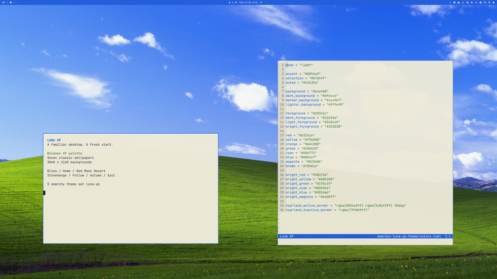

# Luna XP

A light Omarchy theme inspired by Windows XP Luna. Blue borders, warm gray surfaces, green accents, and seven classic wallpapers.



## Install

Requires Omarchy with `colors.toml` theme templates and Omarchy Shell support. Tested with the installed Omarchy 4 development templates.

```sh
omarchy theme install https://github.com/kyryl-bogach/omarchy-luna-xp-theme
```

Select **Luna XP** in the theme menu. Use the background menu to choose another wallpaper.

This theme supplies colors, a blue bar, and the standard Yaru-blue icon selection. Omarchy generates application configurations from its templates.

## Wallpapers

All seven exports are 3840 × 2160 WebP images. Export resolution does not imply native 4K detail.

| Wallpaper | Source pixels | Quality |
| --- | --- | --- |
| Bliss | 4510 × 3627 | High-resolution archive source |
| Home | 3840 × 2160 | Community AI upscale |
| Red Moon Desert | 1920 × 1200 | Enlarged |
| Stonehenge | 1920 × 1200 | Enlarged rescan derivative |
| Follow | 1920 × 1200 | Enlarged |
| Autumn | 4200 × 2800 | High-resolution archive source |
| Azul | 4341 × 2841 | High-resolution archive source |

The exports use an sRGB conversion and a centered crop. Portrait displays and wider displays can crop more of each photograph.

See [SOURCES.md](SOURCES.md) for download links, credits, and asset rights. Source checksums are in [wallpapers.json](wallpapers.json).

## Rebuild

Requires Python 3.11+, ImageMagick, and an sRGB ICC profile. The default profile comes from Ghostscript on Arch Linux.

```sh
python scripts/build-wallpapers.py --download
python scripts/validate.py
```

Source files stay in the ignored `.masters/` directory. The validator requires an installed Omarchy tree.

For other display ratios, export from the source files to avoid a second crop:

```sh
python scripts/build-wallpapers.py --download --aspect 16:10
python scripts/build-wallpapers.py --download --aspect 21:9
```

These exports go into `.exports/`. Copy the desired files into your Omarchy background directory.

## License

The MIT license covers original theme configurations, scripts, and documentation. It excludes wallpaper photographs and their depictions in screenshots.

The photographs remain third-party works. The source archives do not establish a redistribution license. This project has no Microsoft affiliation.
